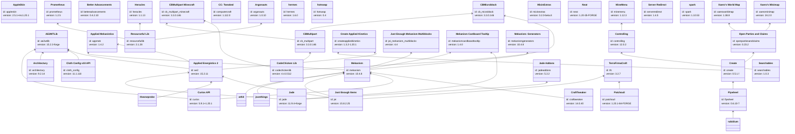

```mermaid
classDiagram
class `ae2`["Applied Energistics 2"] {
  id: ae2
  version: 15.2.11
}
  `ae2` <-- `jei`
  `ae2` <-- `theoneprobe`
  `ae2` <-- `jade`

class `ae2wtlib`["AE2WTLib"] {
  id: ae2wtlib
  version: 15.2.3-forge
}
  `ae2wtlib` <-- `ae2`
  `ae2wtlib` <-- `cloth_config`
  `ae2wtlib` <-- `architectury`
  `ae2wtlib` <-- `curios`

class `appleskin`["AppleSkin"] {
  id: appleskin
  version: 2.5.1+mc1.20.1
}

class `appmek`["Applied Mekanistics"] {
  id: appmek
  version: 1.4.2
}
  `appmek` <-- `ae2`
  `appmek` <-- `mekanism`

class `architectury`["Architectury"] {
  id: architectury
  version: 9.2.14
}

class `argonauts`["Argonauts"] {
  id: argonauts
  version: 1.0.10
}
  `argonauts` <-- `resourcefullib`

class `betteradvancements`["Better Advancements"] {
  id: betteradvancements
  version: 0.4.2.10
}

class `cb_microblock`["CBMicroblock"] {
  id: cb_microblock
  version: 3.3.0.146
}
  `cb_microblock` <-- `codechickenlib`
  `cb_microblock` <-- `cb_multipart`

class `cb_multipart`["CBMultipart"] {
  id: cb_multipart
  version: 3.3.0.146
}
  `cb_multipart` <-- `codechickenlib`

class `cb_multipart_minecraft`["CBMultipart Minecraft"] {
  id: cb_multipart_minecraft
  version: 3.3.0.146
}
  `cb_multipart_minecraft` <-- `codechickenlib`
  `cb_multipart_minecraft` <-- `cb_multipart`

class `cloth_config`["Cloth Config v10 API"] {
  id: cloth_config
  version: 11.1.118
}

class `codechickenlib`["CodeChicken Lib"] {
  id: codechickenlib
  version: 4.4.0.512
}

class `computercraft`["CC: Tweaked"] {
  id: computercraft
  version: 1.112.0
}

class `controlling`["Controlling"] {
  id: controlling
  version: 12.0.2
}
  `controlling` <-- `searchables`

class `crafttweaker`["CraftTweaker"] {
  id: crafttweaker
  version: 14.0.40
}

class `create`["Create"] {
  id: create
  version: 0.5.1.f
}
  `create` <-- `flywheel`

class `createappliedkinetics`["Create Applied Kinetics"] {
  id: createappliedkinetics
  version: 1.3.2-1.20.1
}
  `createappliedkinetics` <-- `ae2`
  `createappliedkinetics` <-- `create`

class `curios`["Curios API"] {
  id: curios
  version: 5.9.1+1.20.1
}

class `flywheel`["Flywheel"] {
  id: flywheel
  version: 0.6.10-7
}
  `flywheel` <-- `rubidium`

class `heracles`["Heracles"] {
  id: heracles
  version: 1.1.13
}
  `heracles` <-- `resourcefullib`

class `hermes`["hermes"] {
  id: hermes
  version: 1.6.0
}

class `hotswap`["hotswap"] {
  id: hotswap
  version: 0.4
}

class `jade`["Jade"] {
  id: jade
  version: 11.9.4+forge
}

class `jadeaddons`["Jade Addons"] {
  id: jadeaddons
  version: 5.2.2
}
  `jadeaddons` <-- `jade`

class `jei`["Just Enough Items"] {
  id: jei
  version: 15.8.2.25
}

class `jei_mekanism_multiblocks`["Just Enough Mekanism Multiblocks"] {
  id: jei_mekanism_multiblocks
  version: 4.4
}
  `jei_mekanism_multiblocks` <-- `mekanism`

class `mekanism`["Mekanism"] {
  id: mekanism
  version: 10.4.8
}
  `mekanism` <-- `crafttweaker`
  `mekanism` <-- `curios`
  `mekanism` <-- `jei`
  `mekanism` <-- `jsonthings`
  `mekanism` <-- `wthit`

class `mekanismcardboardtooltip`["Mekanism Cardboard Tooltip"] {
  id: mekanismcardboardtooltip
  version: 1.4.0
}
  `mekanismcardboardtooltip` <-- `jade`
  `mekanismcardboardtooltip` <-- `mekanism`

class `mekanismgenerators`["Mekanism: Generators"] {
  id: mekanismgenerators
  version: 10.4.8
}
  `mekanismgenerators` <-- `mekanism`

class `minemenu`["MineMenu"] {
  id: minemenu
  version: 1.12.3
}
  `minemenu` <-- `controlling`

class `mixinextras`["MixinExtras"] {
  id: mixinextras
  version: 0.2.0-beta.8
}

class `neat`["Neat"] {
  id: neat
  version: 1.20-35-FORGE
}

class `openpartiesandclaims`["Open Parties and Claims"] {
  id: openpartiesandclaims
  version: 0.23.2
}
  `openpartiesandclaims` <-- `create`

class `patchouli`["Patchouli"] {
  id: patchouli
  version: 1.20.1-84-FORGE
}

class `prometheus`["Prometheus"] {
  id: prometheus
  version: 1.2.5
}
  `prometheus` <-- `resourcefullib`

class `resourcefullib`["Resourceful Lib"] {
  id: resourcefullib
  version: 2.1.28
}

class `searchables`["Searchables"] {
  id: searchables
  version: 1.0.3
}

class `serverredirect`["Server Redirect"] {
  id: serverredirect
  version: 1.4.5
}

class `spark`["spark"] {
  id: spark
  version: 1.10.53
}

class `tfc`["TerraFirmaCraft"] {
  id: tfc
  version: 3.2.7
}
  `tfc` <-- `patchouli`
  `tfc` <-- `jei`

class `xaerominimap`["Xaero's Minimap"] {
  id: xaerominimap
  version: 24.2.0
}
  `xaerominimap` <-- `openpartiesandclaims`

class `xaeroworldmap`["Xaero's World Map"] {
  id: xaeroworldmap
  version: 1.38.8
}
  `xaeroworldmap` <-- `openpartiesandclaims`

```